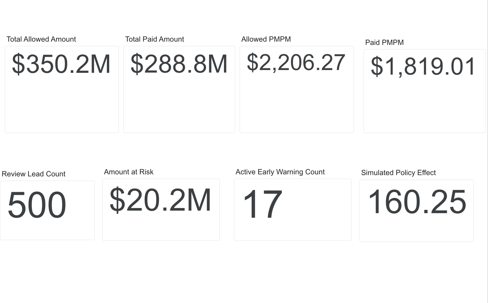
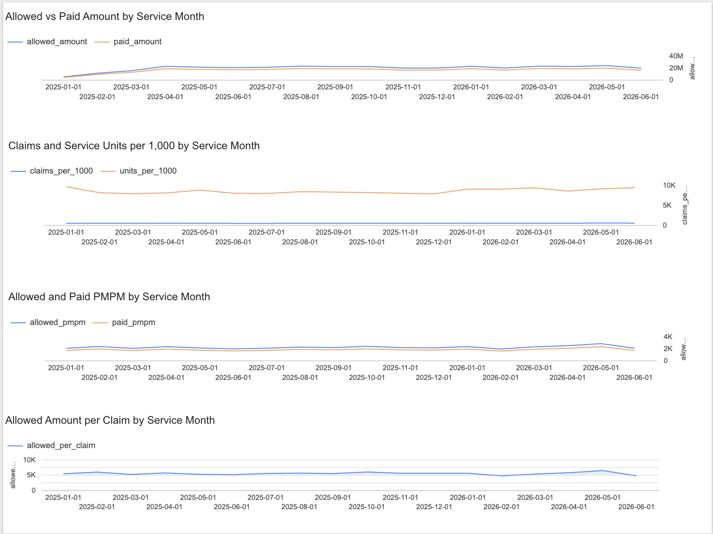
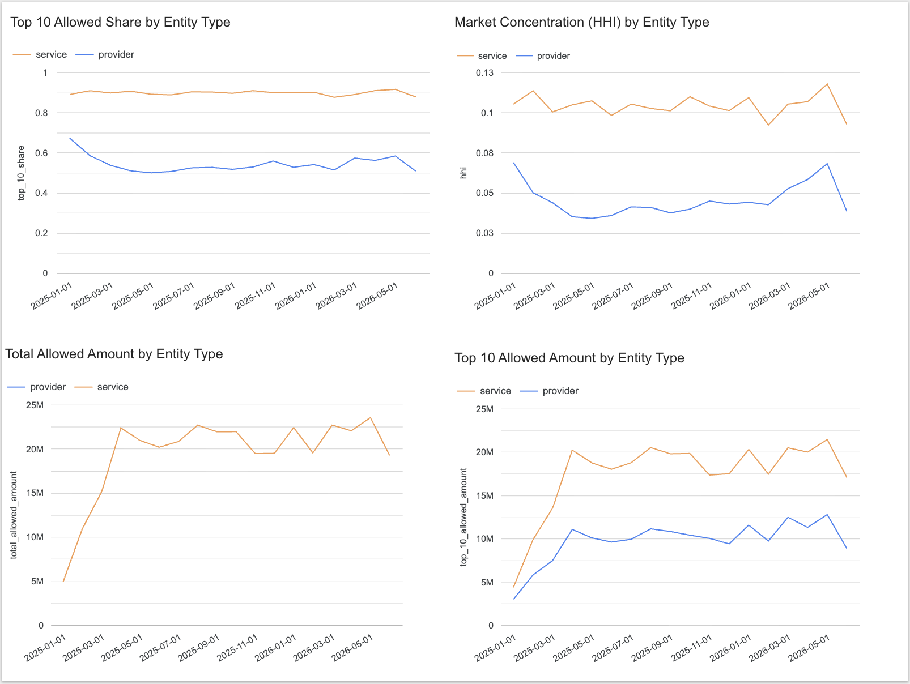
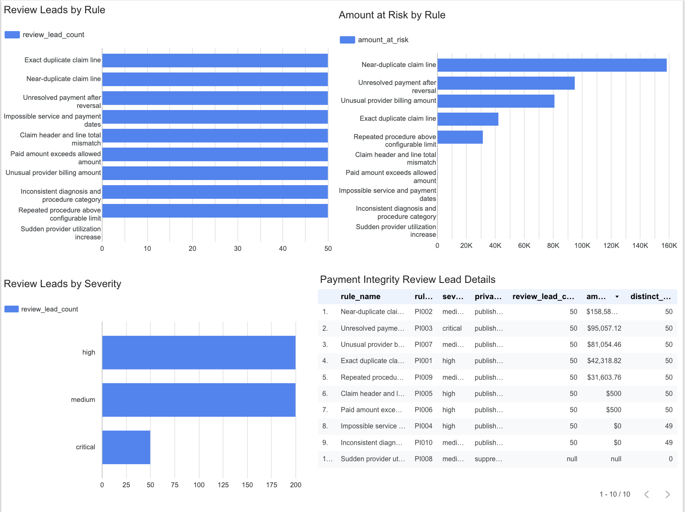
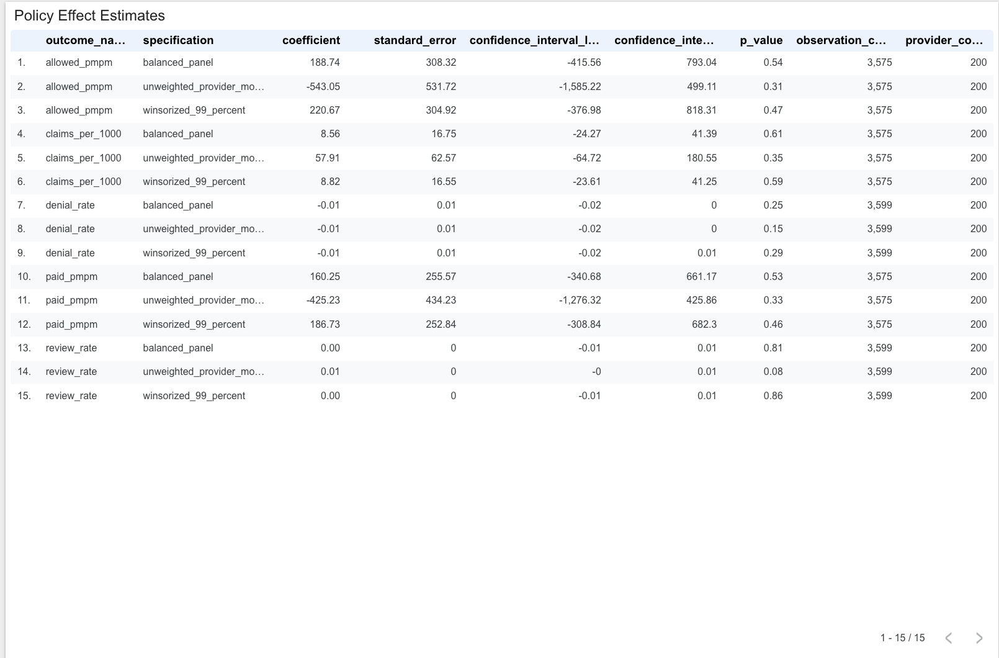
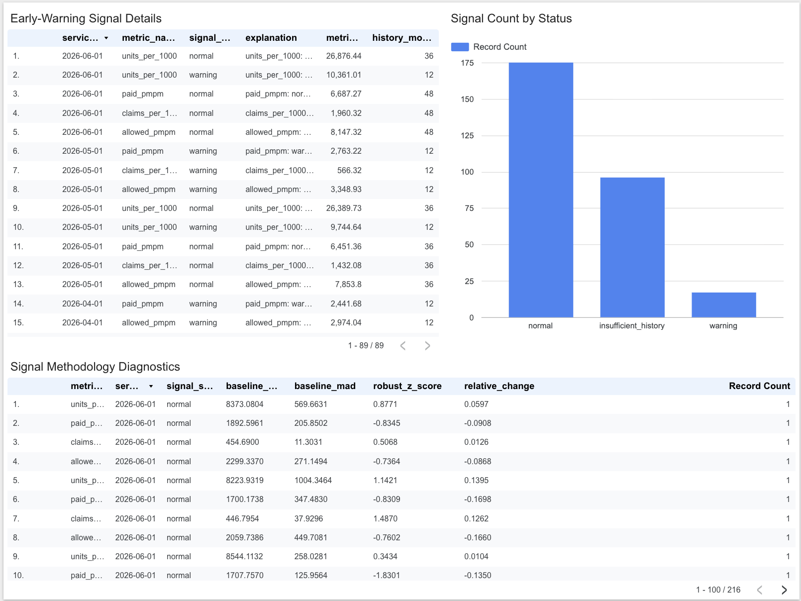
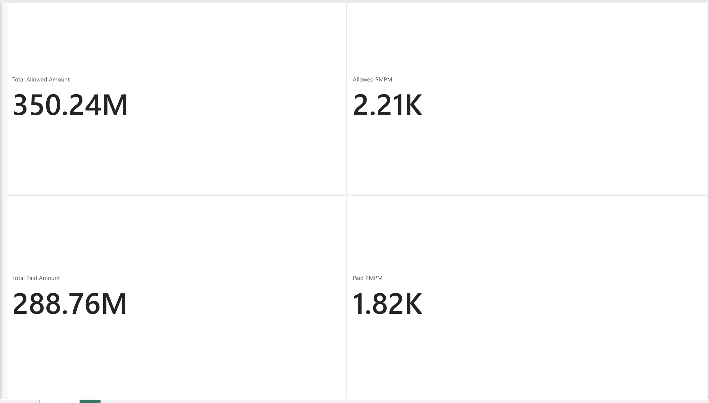

# Healthcare Claims Payment Integrity & Cost Intelligence Platform

An end-to-end healthcare insurance analytics portfolio project that reconciles
medical and pharmacy claims, identifies potentially incorrect payments,
explains emerging cost drivers, and estimates the impact of a simulated
claims-review policy.

## Central business question

> Why did healthcare claims cost change, how much is potentially attributable
> to payment errors, and did the new review policy improve outcomes?

## Project principles

- Use only public-use or synthetic data.
- Treat every payment-integrity flag as a review lead, not proof of fraud.
- Preserve claim and transaction history rather than overwriting adjustments.
- Separate service-date, adjudication-date, and payment-date reporting.
- Make every flag explainable and traceable to a versioned rule.
- Run locally first and use Fabric/Azure for the final cloud demonstration.

## Planned architecture

| Layer | Local development | Cloud demonstration |
|---|---|---|
| Source | CMS SynPUF + generated data | ADLS/OneLake landing area |
| Storage | CSV and Parquet | OneLake/Lakehouse |
| Transformation | Python + DuckDB SQL | Fabric notebook/pipeline/warehouse |
| Validation | pytest + SQL + SAS | Fabric pipeline checks |
| Statistics | pandas, SciPy, statsmodels | Fabric notebook |
| BI | Looker Studio + Power BI web | Governed cross-tool semantic model |
| CI | GitHub Actions | GitHub Actions |

M09 maps the existing M04-M07 schemas into a schema-enabled Fabric Lakehouse,
notebook, pipeline, and SQL analytics endpoint while preserving ground-truth
isolation and separate service/payment date roles. The governed notebook and
pipeline executed successfully on a Fabric Trial capacity in North Central US,
with all 26 tables and 33 reconciliation results passing.

M10 now publishes seven deterministic, tool-neutral dashboard extracts from
the governed analytical surfaces. They reproduce all 14 contracted KPIs,
apply the 11-member privacy threshold, keep service-month and payment-month
measures separate, and exclude evaluation ground truth. The six-page Looker
Studio dashboard and four-KPI Power BI validation report are complete.

## Dashboard gallery

### Executive overview



### Cost and utilization



### Provider and service concentration



### Payment-integrity review leads



### Simulated policy impact



### Methodology and early-warning signals



### Independent Power BI KPI validation



## Target deliverables

- Trusted dimensional claims model with documented grain
- Append-only payment/reversal/adjustment ledger
- Configurable and explainable payment-integrity rules
- Measured anomaly precision, recall, and dollars-at-risk performance
- Cost and utilization early-warning metrics
- Cost-change decomposition
- Difference-in-differences policy evaluation
- SAS/SQL/Python/Power BI reconciliation
- Six-page Looker Studio dashboard, compact Power BI validation report, and formal KPI dictionary
- Privacy, security, and data-quality controls

## Repository layout

```text
config/       Versioned rule and simulation configuration
data/         Local-only raw/processed data plus small publishable samples
docs/         Architecture, decisions, dictionary, governance, and KPIs
fabric/       Fabric notebook and pipeline deployment artifacts
notebooks/    Statistical and exploratory analyses
powerbi/      DAX, theme, semantic-model notes, and final report
sas/          Independent SAS validation
sql/          DDL, transformations, rules, marts, and tests
src/          Python package
tests/        Automated tests
```

## Status

Repository governance, public-data ingestion, clean synthetic operational data
generation, controlled synthetic anomaly injection, the trusted claims model,
and the explainable M05 payment-integrity engine are complete. M06 cost
intelligence generates governed analytical outputs from trusted claims. The
M07 preregistered synthetic difference-in-differences and event-study analysis
is complete. M08 independent SAS reconciliation is complete: SAS 9.4 M8 on
Linux reproduced all 181 governed comparisons with zero failures or missing
SAS values. M09 Fabric execution is complete: the Lakehouse contains 23
ordinary and three restricted tables, and both the validation notebook and
orchestration pipeline succeeded. No paid Azure resource was created. M10 is
complete: the governed extracts, six Looker Studio pages, compact Power BI
validation report, cross-tool KPI reconciliation, and sanitized visual evidence
are finished. M11 portfolio packaging is in progress.

## Safety and limitations

This project does not contain protected health information. Its audit rules are
synthetic analytical examples and are not production medical-payment policies,
clinical recommendations, or evidence of fraud, waste, or abuse.
